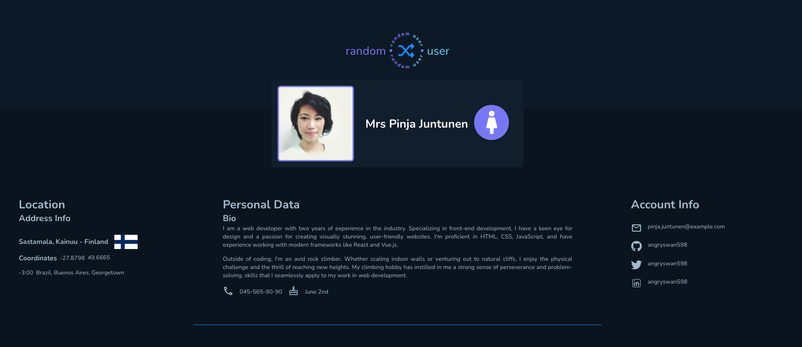

# Random User Data Fetcher

This application leverages the [Random User Generator API](https://randomuser.me/api/) to fetch and display user data. Built with React and JavaScript, it provides a simple interface for retrieving and showcasing random user information.

## Features

- Fetch random user data from the Random User Generator API.
- Display user details including name, email, location, and profile picture.
- Refresh button to load a new random user.
- Simple and clean user interface.

## Demo

